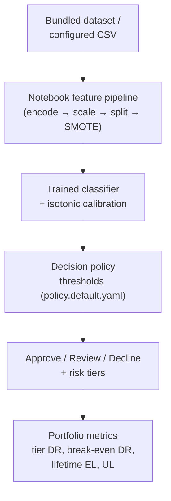

# Credit Risk Decisioning Prototype (Notebook-Based)

## Business Context

Lenders need more than model scores: they need explicit decision rules that balance approval volume and risk outcomes. This **prototype** translates model scores into **illustrative** policy-style rules (tiers, approve/review/decline) and **directional** business interpretation (tradeoff views, SHAP, simple loss framing)—**not** a production policy engine or deployed decision system.

## Problem Statement

- Turn risk scores into **actionable** decisions and **threshold tradeoffs** (approval volume vs default experience among approved).
- Add **explainability** and a **simple, directional** loss lens (clarity over precision).

## Executive Summary

### Observed model performance (corrected pipeline, bundled sample)

All figures below are from the **corrected pipeline** (SMOTE applied after the stratified 80/20 split; honest test set at real class prevalence) with XGBoost as `best_model`:

| Metric | Logistic baseline | XGBoost (tuned) | XGBoost + calibration |
|--------|------------------|-----------------|-----------------------|
| Test set good-loan rate | 81.1% (real) | 81.1% (real) | 81.1% (real) |
| Accuracy | — | **99.3%** | — |
| ROC-AUC | ~0.66 (old balanced split) | **0.9991** | 0.9981 |
| Precision (Fully Paid) | — | 99.2% | 99.2% |
| Recall (Fully Paid) | — | 100.0% | 99.9% |
| Recall (Charged Off) | — | **96.4%** | 96.4% |
| Brier score | — | 0.0066 | **0.0055** |

> **Cross-validation note:** CV accuracy scores (~91–92%) seen in the notebook's tuning cells are computed on the SMOTE-balanced *training* fold—not the held-out test set. Final model evaluation is on the unaugmented stratified test set.

### Critical caveat — near-perfect performance warrants scrutiny

XGBoost's AUC of ~0.999 is **inconsistent with typical consumer credit models** (industry range ~0.65–0.80). The score distribution is effectively binary: the model assigns ≥99% probability to 81% of test loans and ≤1% to 18%, with only 6 loans in the 0.5–0.7 band. Two hypotheses:

1. **`sub_grade` leakage.** Lending Club's sub_grade is a platform-assigned tier that is 96% correlated with `int_rate` and was set with knowledge of the lender's full risk model — potentially including ex-post performance data. A model dominated by this feature partially predicts the outcome using the platform's own assessment, inflating apparent discrimination.
2. **Small 2014 vintage.** With 6,305 rows from a single origination year, the model may fit the idiosyncrasies of that cohort rather than a generalizable credit signal.

**The decisioning framework is valid regardless.** The machinery (tiers, thresholds, EL, UL, calibration, break-even) is designed to sit on top of any classifier. The model's near-perfect discrimination on this sample should be treated as a prototype artifact, not a validated credit signal.

### Interest-rate regression

The secondary linear model predicts `int_rate` and achieves **R² ≈ 0.92**, consistent with the `sub_grade`-dominated pricing structure noted above.

### FICO and credit structure (EDA)

`sub_grade` is treated as ordinal FICO-equivalent; `int_rate` and `sub_grade` are **96% correlated**, consistent with pricing anchored in credit-tier bands. Credit rating dominates the rate model; **`inq_last_6mths` (recent inquiries) dominates the default model** in XGBoost feature importance — a more interpretable and less circular predictor than sub_grade.

## System Flow

## Scope, evidence, and limitations

| | |
|--|--|
| **Data** | Default: `data/loans.csv` (~**5,942** rows after filtering, **2014-era** issue dates). Raw file has 6,305 rows; 363 dropped (non-binary loan_status). Override with `LENDING_CLUB_DATA_PATH`. |
| **Repro** | Pinned `requirements.txt`; cite **git commit** + **data file** when reporting numbers externally. |
| **What this proves** | Decisioning **machinery** and **capital framing** on top of a standard ML notebook—not a validated standalone credit model. |
| **Out of scope** | Not deployed; no monitoring/governance. EL is illustrative, not CECL/IFRS 9. Sample is 2014-era; no claim about current market. AUC ~0.999 should be investigated before treating the model as production-ready. |

Charts (**ROC/PR, confusion matrix, reliability diagrams, threshold sweep, SHAP**) render **in the notebook** when you run cells. For a full executed pass: `pytest --run-notebook` or run the notebook locally.

## Solution Overview

- **Predictive modeling:** ingestion → encoding → scaling → stratified split → **SMOTE on training fold only** → classifiers (logistic, KNN, trees, boosting, **XGBoost**); parallel **interest-rate** regression.
- **Calibration:** `CalibratedClassifierCV` (isotonic, cv=3) wraps `best_model`; reliability diagrams shown before/after. `calibrated_model` is used in all downstream EL calculations.
- **Decision layer:** `src/decisioning.py` + `config/policy.default.yaml` map calibrated **P(Fully Paid)** to **tiers** and **approve / review / decline**; notebook applies this on the test set.
- **Evaluation:** standard metrics on the honest (imbalanced) test set, plus **threshold sweep** annotated with break-even DR, tier calibration table, **lifetime EL**, **portfolio UL**, and SHAP explanations.

## Technical Implementation

| Artifact | Role |
|----------|------|
| `Credit_Underwriting_Decisioning-Lending_Club.ipynb` | End-to-end pipeline: preprocessing → models → calibration → decisioning / SHAP / capital simulation |
| `src/decisioning.py` | Tiers, decisions, threshold sweep, break-even DR, lifetime EL, UL, tier calibration |
| `config/policy.default.yaml` | Policy thresholds, LGD (Basel II source documented), tenor, revenue per loan |
| `scripts/run_decisioning.py` | CLI: apply policy to a `p_good` CSV; outputs single-period EL, lifetime EL, UL, break-even |
| `docs/PORTFOLIO_DECISIONING.md` | Stakeholder-oriented decisioning narrative |
| `docs/RUNBOOK.md` | Environment, data snapshot, operations |
| `docs/MODEL_CARD.md` | Scope, data, pipeline methodology, actual metrics, known limitations |
| `docs/CECL_MAPPING.md` | ASC 326 / IFRS 9 gap map — what is and isn't CECL-compliant |
| `docs/ADVERSE_ACTION.md` | ECOA/Reg B adverse action workflow and review-bucket disposition |
| `docs/TESTING.md` | Pytest layers, markers, notebook E2E |
| `requirements.txt` | Pinned dependencies |

## Testing

`pytest` with markers (`unit`, `smoke`, `regression`, `notebook_e2e`): 29 tests covering decisioning unit tests (break-even, lifetime EL, UL, tier calibration, and originals), reference-model smoke/regression, notebook schema + optional full `nbconvert` execution. Details: `docs/TESTING.md`.

## Extension Opportunities

- **Leakage investigation.** Remove `sub_grade` and `int_rate` from the feature set and rerun; if AUC drops to ~0.65–0.75, the leakage hypothesis is confirmed. Retain `inq_last_6mths`, `dti`, `annual_inc`, and other a-priori features.
- **Out-of-time validation** on a different origination vintage to test true generalization.
- Survival / time-to-default modeling; **monitoring** (drift, overrides, adverse-action rates).
- Replace Basel II LGD floor with portfolio-specific empirical recovery model.
- Add macro-conditional PD overlay to move toward CECL compliance (see `docs/CECL_MAPPING.md`).
- Implement override logging and fair-lending disparate-impact monitoring (see `docs/ADVERSE_ACTION.md`).

## Key Takeaways

- **ML → calibration → explicit rules → directional outcomes** without rebuilding the core models.
- **SMOTE applied exclusively to the training fold** (not before split) for an honest test-set evaluation; recall on the minority class (Charged Off) drops from 98.9% to 96.4% — the real cost of correcting the methodology.
- **Near-perfect AUC (~0.999) is a signal to investigate, not celebrate.** Score distribution is near-binary; only 6 of 1,189 test loans fall in the mid-range [0.5–0.7]. The most likely cause is `sub_grade` or `int_rate` acting as proxies for the platform's own credit outcome.
- **Break-even DR (66.7%) far exceeds observed DR (0.52%)** — every modeled threshold is profitable on this data, though this likely reflects the leakage issue rather than genuine predictive power.
- **CECL gap map and adverse-action workflow** document what a production system would need to add.
- **Prototype** for communication and exploration—readable in `README`, notebook, and `docs/PORTFOLIO_DECISIONING.md`.

## Skills Demonstrated

Credit Risk, Underwriting Policy, Machine Learning, Decision Systems, Explainable AI (SHAP), Portfolio Simulation, Python, Product-Oriented Analytics

## Quick start (clone and run)

Python **3.9+**; **CI** uses **3.12**; **3.13** validated locally (Windows).

1. `git clone https://github.com/carjam/credit-underwriting.git` → `cd credit-underwriting`
2. `python -m venv .venv` → activate (`.venv\Scripts\activate` on Windows, `source .venv/bin/activate` on Unix)
3. `pip install -r requirements.txt`
4. `pytest` — fast suite; notebook E2E skipped unless `CI=true` / `RUN_NOTEBOOK_E2E=1` / `--run-notebook`. Quick skip: `SKIP_NOTEBOOK_E2E=1 pytest` (Unix) or `$env:SKIP_NOTEBOOK_E2E='1'; pytest` (PowerShell)
5. Open `Credit_Underwriting_Decisioning-Lending_Club.ipynb` (default data `data/loans.csv`; or set `LENDING_CLUB_DATA_PATH`)
6. Optional: `pytest --run-notebook` · `python scripts/run_decisioning.py --scores-csv your.csv --policy config/policy.default.yaml`

More detail: `docs/RUNBOOK.md`.
